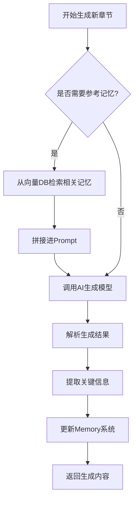

## 🧠 一、问题背景

当生成的小说达到几百万字时，以下挑战会变得非常突出：

| 挑战 | 描述 |
|------|------|
| 上下文窗口限制 | 大多数LLM模型（如GPT-3.5、LLaMA等）上下文长度有限（4k~32k tokens） |
| 内容一致性 | 角色性格、世界观设定、伏笔回收容易丢失或冲突 |
| 逻辑连贯性 | 长期情节发展可能偏离大纲 |
| 记忆检索效率 | AI需要快速访问关键信息，而不是每次都重新学习 |

---

## 📦 二、Memory系统设计目标

| 目标 | 描述 |
|------|------|
| ✅ 高效存储和检索长期上下文 | 超出模型上下文窗口的内容也能被AI“记住” |
| ✅ 支持结构化+非结构化数据 | 包括章节摘要、角色状态、世界观规则 |
| ✅ 实时更新机制 | 在生成过程中动态更新记忆内容 |
| ✅ 可查询接口 | AI可通过API/数据库查询历史信息 |
| ✅ 支持版本控制 | 便于回溯和调试 |
| ✅ 支持语义搜索 | AI可根据关键词或意图查找相关记忆 |

---

## 🏗️ 三、Memory系统架构设计（分层结构）

```
[用户输入] → [短期记忆] ↔ [长期记忆] ↔ [知识图谱]
                  ↓
              [AI推理引擎]
```

### 1. 短期记忆（Short-Term Memory）
- **作用**：模拟模型当前上下文窗口内的临时记忆。
- **实现方式**：
  - 使用 Prompt 中显式注入最近的段落、章节摘要。
  - 使用滑动窗口策略（Sliding Window），保留最近 N 个段落。
- **优点**：
  - 快速响应局部变化。
  - 易于集成到推理流程中。
- **缺点**：
  - 容量有限。

---

### 2. 长期记忆（Long-Term Memory）
- **作用**：保存整个小说项目的关键信息（角色、情节、设定）。
- **实现方式**：
  - 使用向量化数据库（如 **Pinecone / Weaviate / Chroma / Qdrant**）进行语义记忆存储。
  - 存储单位：
    - 章节摘要（Summary）
    - 关键情节点（Plot Points）
    - 角色行为记录（Character Actions）
    - 世界观变更记录（Worldbuilding Updates）

#### 示例结构：
```json
{
  "type": "summary",
  "chapter": 1,
  "content": "主角李航收到神秘信号，决定踏上星际旅程。",
  "embedding": [0.87, -0.34, 0.65, ...], // 向量化表示
  "timestamp": "2025-04-08T15:30:00Z"
}
```

---

### 3. 知识图谱（Knowledge Graph）
- **作用**：构建结构化的记忆网络，用于逻辑推理和一致性校验。
- **技术选型**：
  - Neo4j / Amazon Neptune
- **节点类型**：
  - `Character`（角色）
  - `Event`（事件）
  - `Location`（地点）
  - `Rule`（世界规则）
- **关系示例**：
  - `(李航)-[:WITNESSED]->(飞船爆炸)`
  - `(星环联邦)-[:HAS_RULE]->("禁止使用反物质武器")`

---

## 💾 四、Memory系统的数据库 Schema 设计（PostgreSQL + Vector DB）

### 1. 记忆条目表（PostgreSQL）
```sql
CREATE TABLE memory_entries (
    id UUID PRIMARY KEY DEFAULT gen_random_uuid(),
    project_id UUID REFERENCES projects(id),
    entry_type VARCHAR(50), -- 如 summary / event / character_state
    content TEXT NOT NULL,
    metadata JSONB,
    created_at TIMESTAMPTZ DEFAULT NOW()
);
```

### 2. 向量记忆表（Vector DB 表结构示意）
> 例如使用 Pinecone 或本地部署的 Chroma

```python
# 示例伪代码
vector_db.add(
    ids=["summary_001"],
    vectors=[get_embedding("主角李航收到神秘信号...")],
    metadatas={
        "project_id": "proj_123",
        "type": "summary",
        "chapter": 1,
        "timestamp": "2025-04-08T15:30:00Z"
    }
)
```

---

## 🔍 五、AI如何使用Memory系统

### 1. 推理前准备
- **从长期记忆中检索相关信息**
  ```python
  def retrieve_memory(query, project_id):
      # 使用语义向量匹配
      results = vector_db.query(
          query_text=query,
          filter={"project_id": project_id},
          top_k=5
      )
      return format_results(results)
  ```

- **拼接到Prompt中**
  ```python
  prompt = f"""
  【你的任务】根据以下信息继续写下一章：

  === 记忆片段 ===
  {retrieve_memory("主角李航的最新行动", project_id)}

  === 当前大纲 ===
  {current_outline}

  === 请续写第一章之后的情节 ===
  """
  ```

### 2. 推理后更新
- **提取关键信息并保存到Memory**
  ```python
  def update_memory(content, project_id, entry_type):
      embedding = get_embedding(content)
      save_to_vector_db(embedding, content, project_id, entry_type)
      save_to_postgres(content, project_id, entry_type)
  ```

---

## ⚙️ 六、Memory系统的技术栈建议

| 组件 | 技术选型 | 说明 |
|------|----------|------|
| 向量数据库 | Pinecone / Weaviate / Chroma | 语义检索 |
| 关系数据库 | PostgreSQL | 结构化记忆管理 |
| 图数据库 | Neo4j | 构建人物关系与逻辑网络 |
| Embedding模型 | Sentence-BERT / OpenAI Ada-002 | 向量化处理 |
| 缓存 | Redis | 实时记忆缓存 |
| 搜索 | Elasticsearch | 快速关键字检索 |

---

## 🔄 七、Memory系统的工作流（简化版）



---

## ✅ 八、总结：Memory系统的核心价值

| 功能 | 描述 |
|------|------|
| ✅ 上下文扩展 | 解决模型上下文长度限制 |
| ✅ 一致性保障 | 避免角色设定矛盾、世界观冲突 |
| ✅ 情节追踪 | 自动识别伏笔、高潮、转折点 |
| ✅ 可追溯 | 所有记忆均可回溯、审计、分析 |
| ✅ 提升质量 | AI能更准确地延续故事风格与逻辑 |